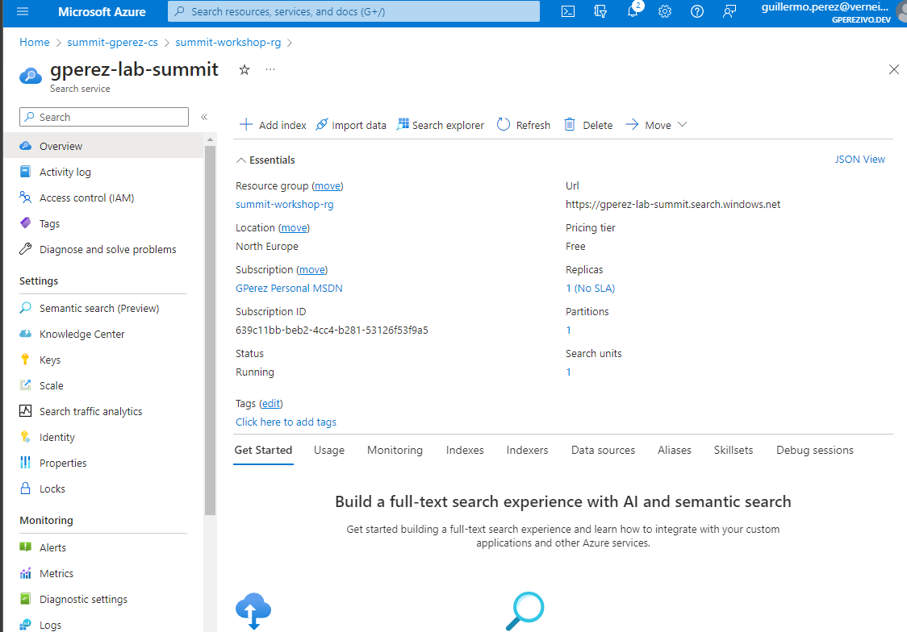
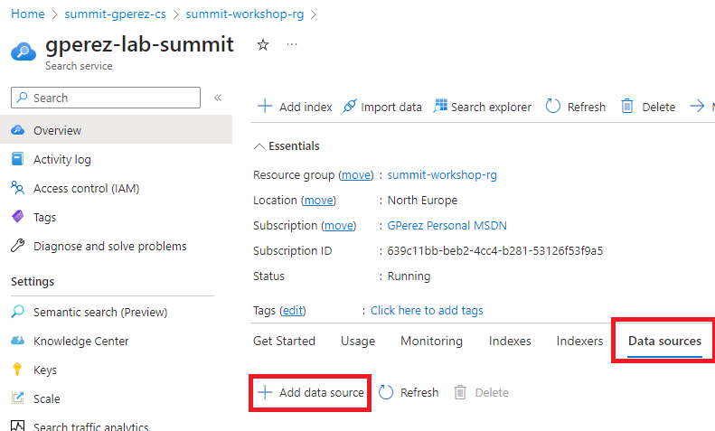
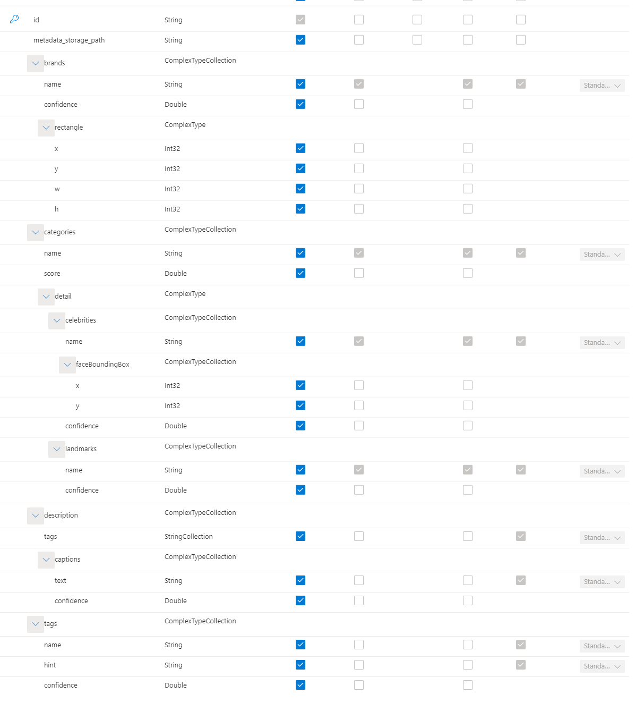
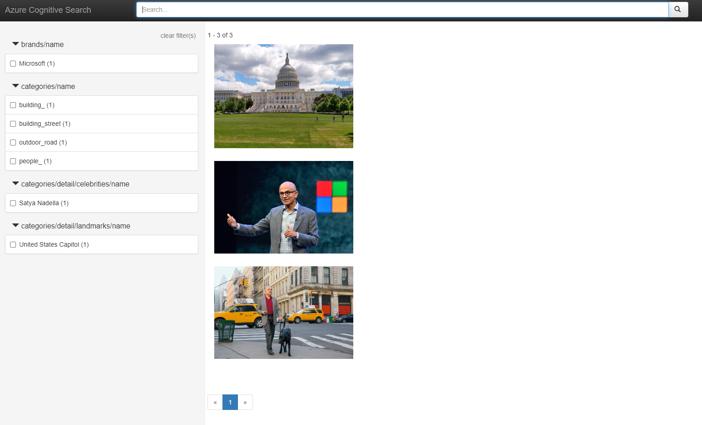

# Laboratorio: Azure Cognitive Search

## Objetivo

Vamos a crear un Azure Cognitive Search para hacer un buscador de imágenes que tenemos en un blob storage.

## Crear recursos
 - Desplegar un grupo de recursos (o tu grupo de recursos de la práctica anterior)
 ### Crear un Azure Cognitive Search
   - En el buscador de recursos, buscar __Azure Cognitive Search__
   - Seleccionar __Create__ o __Crear__
   - Seleccionar el grupo de recursos creado
   - Seleccionar el plan de __tarifa free__
  
 
> _Así se verá el recurso desplegado_

 ### Crear un Cognitive Service
 - En el buscador de recursos, buscar __Cognitive Services__
 - Seleccionar la opción __Cognitive Services multi-service account__ o __Cuenta multi-servicio de Cognitive Services__
   - Si no lo encontramos: [Crear un Cognitive Service](https://portal.azure.com/#create/Microsoft.CognitiveServicesAllInOne)
  
 - Seleccionar el grupo de recursos creado
 - Seleccionar la ubicación __North Europe__ o __Europa del Norte__
 - Seleccionar el plan de __tarifa free__ (Solo se puede tener uno por suscripción, si ya tenemos uno no hace falta crear otro)
 - Seleccionar __Review + create__ o __Revisar y crear__

 ### Crear una cuenta de almacenamiento.
   - Si has hecho la práctica de Azure ML puedes usar la cuenta de almacenamiento que creaste en esa práctica creando un contenedor nuevo
   - Si no, crea una cuenta de almacenamiento nueva y crea un contenedor nuevo
 - Establecer el contenedor como público (este paso es opcional)
 - Subir las imágenes de la carpeta `images` a tu contenedor
  
 
## Crear un datasource
- Accediendo al recurso de Azure Cognitive Search, en el menú lateral, seleccionar __Overview__ o __Visión general__.
- Seleccionar la pestaña __Data sources__ o __Orígenes de datos__.
- Seleccionar __Add data source__ o __Agregar origen de datos__.


- Rellenar el formulario de creación con el nombre y hacer clic en seleccionar la cadena de conexión.
- Buscar la cuenta de almacenamiento y seleccionar el contenedor creado anteriormente.
- Seleccionar __OK__ y __Save__ o __Guardar__.

## Crear un skillset

El skillset es la parte que nos permite llamar a componentes externos en el proceso de indexación. En este caso, vamos a pasar el contenido de las imágenes por el servicio de Computer Vision de Azure para extraer las etiquetas de las imágenes, una descripción, marcas y personajes.

- Accediendo al recurso de Azure Cognitive Search, en el menú lateral, seleccionar __Overview__ o __Visión general__.
- Seleccionar la pestaña __Skillsets__ o __Conjuntos de habilidades__.
- Seleccionar __Add skillset__ o __Agregar conjunto de habilidades__.
- Utilizando la plantilla `Image Analysis Skill` que nos proporciona el portal añadirlo dentro de los corchetes de `skills` del JSON.
- En el apartado `visualFeatures` añadir `tags`, `description`, `categories` y `brands`.
- En el apartado `inputs` añadir el nombre del campo que queremos pasar al servicio de Computer Vision, en este caso `image` y el origen de los datos, en este caso `/document/normalized_images/*`.
- En el apartado `outputs` añadir los campos que queremos que se indexen en el buscador, en este caso `tags`, `description`, `categories` y `brands`.
- Introducir el nombre tanto de la skill como del skillset.
- En la pestaña de __Cognitive Services__ seleccionar el servicio que hemos creado anteriormente.
- Hacer clic en __Save__ o __Guardar__.
  
__Ejemplo de json:__


```json 
{ 
  "name": "image-data-extraction", 
  "skills": [
    {
      "@odata.type": "#Microsoft.Skills.Vision.ImageAnalysisSkill",
      "name": "image-data",
      "description": "",
      "context": "/document/normalized_images/*",
      "defaultLanguageCode": "en",
      "visualFeatures": [
        "brands",
        "categories",
        "description",
        "tags"
      ],
      "details": [],
      "inputs": [
        {
          "name": "image",
          "source": "/document/normalized_images/*"
        }
      ],
      "outputs": [
        {
          "name": "brands"
        },
        {
          "name": "categories"
        },
        {
          "name": "description"
        },
        {
          "name": "tags"
        }
      ]
    }
  ],

}
```

## Crear un índice

El índice es la parte que nos permite definir los campos que se van a indexar y que se van a poder buscar. Es decir, el contenido que se va a poder buscar.

- Accediendo al recurso de Azure Cognitive Search, en el menú lateral, seleccionar __Overview__ o __Visión general__.
- Seleccionar la pestaña __Indexes__ o __Índices__.
- Seleccionar __Add index__ o __Agregar índice__.
- Introducir el nombre del índice.
- En el apartado `fields` añadir la siguiente columna: 
  - metadata_storage_path: 
    - type: `Edm.String`
    - key: `false`
    - retrievable: `true`
- Guardamos el índice.
- Una vez creado y guardado, lo seleccionamos de la lista de índices y entramos en el menú de `Edit JSON` o `Editar JSON`.
- En la lista de fiels añadimos el siguiente fragmento
```json 
{
      "name": "brands",
      "type": "Collection(Edm.ComplexType)",
      "fields": [
        {
          "name": "name",
          "type": "Edm.String",
          "searchable": true,
          "filterable": true,
          "retrievable": true,
          "sortable": false,
          "facetable": true,
          "key": false,
          "indexAnalyzer": null,
          "searchAnalyzer": null,
          "analyzer": null,
          "normalizer": null,
          "synonymMaps": []
        },
        {
          "name": "confidence",
          "type": "Edm.Double",
          "searchable": false,
          "filterable": false,
          "retrievable": true,
          "sortable": false,
          "facetable": false,
          "key": false,
          "indexAnalyzer": null,
          "searchAnalyzer": null,
          "analyzer": null,
          "normalizer": null,
          "synonymMaps": []
        },
        {
          "name": "rectangle",
          "type": "Edm.ComplexType",
          "fields": [
            {
              "name": "x",
              "type": "Edm.Int32",
              "searchable": false,
              "filterable": false,
              "retrievable": true,
              "sortable": false,
              "facetable": false,
              "key": false,
              "indexAnalyzer": null,
              "searchAnalyzer": null,
              "analyzer": null,
              "normalizer": null,
              "synonymMaps": []
            },
            {
              "name": "y",
              "type": "Edm.Int32",
              "searchable": false,
              "filterable": false,
              "retrievable": true,
              "sortable": false,
              "facetable": false,
              "key": false,
              "indexAnalyzer": null,
              "searchAnalyzer": null,
              "analyzer": null,
              "normalizer": null,
              "synonymMaps": []
            },
            {
              "name": "w",
              "type": "Edm.Int32",
              "searchable": false,
              "filterable": false,
              "retrievable": true,
              "sortable": false,
              "facetable": false,
              "key": false,
              "indexAnalyzer": null,
              "searchAnalyzer": null,
              "analyzer": null,
              "normalizer": null,
              "synonymMaps": []
            },
            {
              "name": "h",
              "type": "Edm.Int32",
              "searchable": false,
              "filterable": false,
              "retrievable": true,
              "sortable": false,
              "facetable": false,
              "key": false,
              "indexAnalyzer": null,
              "searchAnalyzer": null,
              "analyzer": null,
              "normalizer": null,
              "synonymMaps": []
            }
          ]
        }
      ]
    },
    {
      "name": "categories",
      "type": "Collection(Edm.ComplexType)",
      "fields": [
        {
          "name": "name",
          "type": "Edm.String",
          "searchable": true,
          "filterable": true,
          "retrievable": true,
          "sortable": false,
          "facetable": true,
          "key": false,
          "indexAnalyzer": null,
          "searchAnalyzer": null,
          "analyzer": null,
          "normalizer": null,
          "synonymMaps": []
        },
        {
          "name": "score",
          "type": "Edm.Double",
          "searchable": false,
          "filterable": false,
          "retrievable": true,
          "sortable": false,
          "facetable": false,
          "key": false,
          "indexAnalyzer": null,
          "searchAnalyzer": null,
          "analyzer": null,
          "normalizer": null,
          "synonymMaps": []
        },
        {
          "name": "detail",
          "type": "Edm.ComplexType",
          "fields": [
            {
              "name": "celebrities",
              "type": "Collection(Edm.ComplexType)",
              "fields": [
                {
                  "name": "name",
                  "type": "Edm.String",
                  "searchable": true,
                  "filterable": true,
                  "retrievable": true,
                  "sortable": false,
                  "facetable": true,
                  "key": false,
                  "indexAnalyzer": null,
                  "searchAnalyzer": null,
                  "analyzer": null,
                  "normalizer": null,
                  "synonymMaps": []
                },
                {
                  "name": "faceBoundingBox",
                  "type": "Collection(Edm.ComplexType)",
                  "fields": [
                    {
                      "name": "x",
                      "type": "Edm.Int32",
                      "searchable": false,
                      "filterable": false,
                      "retrievable": true,
                      "sortable": false,
                      "facetable": false,
                      "key": false,
                      "indexAnalyzer": null,
                      "searchAnalyzer": null,
                      "analyzer": null,
                      "normalizer": null,
                      "synonymMaps": []
                    },
                    {
                      "name": "y",
                      "type": "Edm.Int32",
                      "searchable": false,
                      "filterable": false,
                      "retrievable": true,
                      "sortable": false,
                      "facetable": false,
                      "key": false,
                      "indexAnalyzer": null,
                      "searchAnalyzer": null,
                      "analyzer": null,
                      "normalizer": null,
                      "synonymMaps": []
                    }
                  ]
                },
                {
                  "name": "confidence",
                  "type": "Edm.Double",
                  "searchable": false,
                  "filterable": false,
                  "retrievable": true,
                  "sortable": false,
                  "facetable": false,
                  "key": false,
                  "indexAnalyzer": null,
                  "searchAnalyzer": null,
                  "analyzer": null,
                  "normalizer": null,
                  "synonymMaps": []
                }
              ]
            },
            {
              "name": "landmarks",
              "type": "Collection(Edm.ComplexType)",
              "fields": [
                {
                  "name": "name",
                  "type": "Edm.String",
                  "searchable": true,
                  "filterable": true,
                  "retrievable": true,
                  "sortable": false,
                  "facetable": true,
                  "key": false,
                  "indexAnalyzer": null,
                  "searchAnalyzer": null,
                  "analyzer": null,
                  "normalizer": null,
                  "synonymMaps": []
                },
                {
                  "name": "confidence",
                  "type": "Edm.Double",
                  "searchable": false,
                  "filterable": false,
                  "retrievable": true,
                  "sortable": false,
                  "facetable": false,
                  "key": false,
                  "indexAnalyzer": null,
                  "searchAnalyzer": null,
                  "analyzer": null,
                  "normalizer": null,
                  "synonymMaps": []
                }
              ]
            }
          ]
        }
      ]
    },
    {
      "name": "description",
      "type": "Collection(Edm.ComplexType)",
      "fields": [
        {
          "name": "tags",
          "type": "Collection(Edm.String)",
          "searchable": true,
          "filterable": false,
          "retrievable": true,
          "sortable": false,
          "facetable": false,
          "key": false,
          "indexAnalyzer": null,
          "searchAnalyzer": null,
          "analyzer": null,
          "normalizer": null,
          "synonymMaps": []
        },
        {
          "name": "captions",
          "type": "Collection(Edm.ComplexType)",
          "fields": [
            {
              "name": "text",
              "type": "Edm.String",
              "searchable": true,
              "filterable": false,
              "retrievable": true,
              "sortable": false,
              "facetable": false,
              "key": false,
              "indexAnalyzer": null,
              "searchAnalyzer": null,
              "analyzer": null,
              "normalizer": null,
              "synonymMaps": []
            },
            {
              "name": "confidence",
              "type": "Edm.Double",
              "searchable": false,
              "filterable": false,
              "retrievable": true,
              "sortable": false,
              "facetable": false,
              "key": false,
              "indexAnalyzer": null,
              "searchAnalyzer": null,
              "analyzer": null,
              "normalizer": null,
              "synonymMaps": []
            }
          ]
        }
      ]
    }, 
    {
      "name": "tags",
      "type": "Collection(Edm.ComplexType)",
      "fields": [
        {
          "name": "name",
          "type": "Edm.String",
          "searchable": true,
          "filterable": false,
          "retrievable": true,
          "sortable": false,
          "facetable": true,
          "key": false,
          "indexAnalyzer": null,
          "searchAnalyzer": null,
          "analyzer": null,
          "normalizer": null,
          "synonymMaps": []
        },
        {
          "name": "hint",
          "type": "Edm.String",
          "searchable": true,
          "filterable": false,
          "retrievable": true,
          "sortable": false,
          "facetable": false,
          "key": false,
          "indexAnalyzer": null,
          "searchAnalyzer": null,
          "analyzer": null,
          "normalizer": null,
          "synonymMaps": []
        },
        {
          "name": "confidence",
          "type": "Edm.Double",
          "searchable": false,
          "filterable": false,
          "retrievable": true,
          "sortable": false,
          "facetable": false,
          "key": false,
          "indexAnalyzer": null,
          "searchAnalyzer": null,
          "analyzer": null,
          "normalizer": null,
          "synonymMaps": []
        }
      ]
    }
```

Con esto incluiremos los campos que necesitamos para almacenar la información de la imagen que obtenemos del skillset.

Esto podemos hacerlo también mediante el formulario inicial de fields, pero por la complejidad de los tipos, es más sencillo hacerlo mediante el editor de código.




> __Nota:__ Si ya tenemos un índice creado, podemos usarlo, pero tendremos que añadir los campos que hemos añadido en el skillset.
> 

## Crear un indexador

El indexador es el proceso que se encarga de leer los datos de la fuente de datos y los indexa en el índice tras aplicar los skills.

- Vamos a la sección de Indexers y pulsamos en __Add Indexer__.
- Seleccionamos el índice que hemos creado en el paso anterior.
- Seleccionamos la fuente de datos que hemos creado con las imágenes.
- Seleccionamos el skillset que hemos creado de analisis de imágenes.
- En la opción de `Image action` seleccionamos `GenerateNormalizedImages` para que se procesen las imágenes y se pasen por el skillset.
- En la pestaña de `Indexer Definition (JSON)` vamos a introducir el siguiente contenido dentro de los corchetes de `outputFieldMappings`:

```json
  {
      "sourceFieldName": "/document/normalized_images/*/description",
      "targetFieldName": "description"
    },
    {
      "sourceFieldName": "/document/normalized_images/*/tags/*",
      "targetFieldName": "tags"
    },
    {
      "sourceFieldName": "/document/normalized_images/*/categories/*",
      "targetFieldName": "categories"
    },
    {
      "sourceFieldName": "/document/normalized_images/*/brands/*",
      "targetFieldName": "brands"
    }

```

Con esto indicamos que los campos que se generan en el skillset se mapeen a los campos del índice.
  - Guardamos el indexer y lo ejecutamos.

## Buscar en el índice

- Vamos a la sección de __Search Explorer__.
- Seleccionamos el índice que hemos creado.
- En la caja de texto de consulta introducimos `*` para que nos devuelva todos los documentos.
- Pulsamos en __Search__.
- En la parte inferior de la pantalla veremos los resultados de la búsqueda.
  
## Crear una aplicación de búsqueda

- Vamos a la sección de __Indexes__ y seleccionamos el índice que hemos creado.
- En la parte superior pulsamos en __Create Demo App__.
  > __Nota:__ Nos pedirá que modifiquemos el CORS para poder acceder de manera externa al recurso, aceptamos y guardamos.
- En `Individual result` asignamos las siguientes columnas del índice: 
  -  `metadata_storage_path` en `Thumbnail`
  -  `metadata_storage_path` en `Title`
  -  `description.captions.text` en `Description`
-  En la sección `Sidebar` podemos seleccionar los campos que sean _facetables_ de nuestro indice para que aparezcan en la barra lateral de la aplicación con un recuento de los valores que hay en cada uno.
    - `brands/name`
    - `categories/name`
    - `categories/detail/celebrities/name`
    - `categories/detail/landmarks/name`
    - `tags/name`
- Creamos la aplicación y abrimos el html que se descarga.
  

